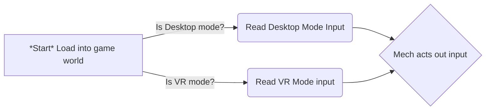

# Turret & Mech Defense Source Code

Hi there! This is the source code repo for a fun tower defense game that I am currently working on.

Here's a couple videos showcasing what I have built so far:

Turret Defense Test:

[](https://www.youtube.com/watch?v=zOmDsLUChCE)

Mech Tech demo : 
[[](https://www.youtube.com/watch?v=w0hPq85CXyM)](https://www.youtube.com/watch?v=w0hPq85CXyM)


## Why develop this game?

I have always loved tower defense games as well as the MechWarrior franchise, I thought that the two elements of piloting a mech and tending & managing towers would blend well together! 
In addition to that-- Massive Loop does not currently have such a minigame. We have very recently allowed C# scripting in Massive Loop, which opens a lot of doors that were a little harder to access through Lua.


## Design

I started by first writing the code for the mech, encapsulating movement, and ensuring that my method for gathering user input was correct. Once that was done, I moved onto deciding how both Desktop Mode players and VR mode players could potentially utilize the same mech but with different control schemes ascribed to them, as the input method is fairly different between the two gameplay modes.

The Desktop Mode control scheme is the standard WASD movement, with your mouse being your aim vector that ultimately changes where the mech is pointing its weapon reference. For VR mode, there are two options. VR users *can* pilot the desktop mode mech, and aim, with good levels of success. They also have the option of grabbing onto two hand controllers present in the cockpit for the mech which dictate to the mech where to point their weapons. It acts as a puppet of sorts!




```c#
   void Update(){
    if (station.IsOccupied)
    {
        player = station.GetPlayer();
        if (player.IsLocal)
        {
            underLocalPlayerControl = true;
            input = station.GetInput();
            if (direction == 0)
            {
                direction = 1;
            }
		if (MassiveLoopClient.IsInDesktopMode)
        {
            HandleDesktopModeInput(input);
        }
        else
        {
            HandleVRModeInput(input);
        }

        if (playerCamera != null)
        {
            // Updated LookPos based on playerCamera's direction
            LookPos.transform.position = playerCamera.position + playerCamera.forward * 14.0f; // Adjust distance as needed

            float angularDifferenceBetweenPortalRotations = Quaternion.Angle(playerCamera.rotation, LookPos.transform.rotation);
            Quaternion portalRotationalDifference = Quaternion.AngleAxis(angularDifferenceBetweenPortalRotations, Vector3.up);

        }
    }
    else if (!player.IsLocal)
    {
        underLocalPlayerControl = false;
    }
}
else if (!station.IsOccupied)
{
    underLocalPlayerControl = false;
}
}
```


The reason why I run the following function : 


`float angularDifferenceBetweenPortalRotations = Quaternion.Angle(playerCamera.rotation, LookPos.transform.rotation);
            Quaternion portalRotationalDifference = Quaternion.AngleAxis(angularDifferenceBetweenPortalRotations, Vector3.up);`

Is to effect the aim constraint object, and reposition it to where the player is looking, which gives the mech its player look reference.


